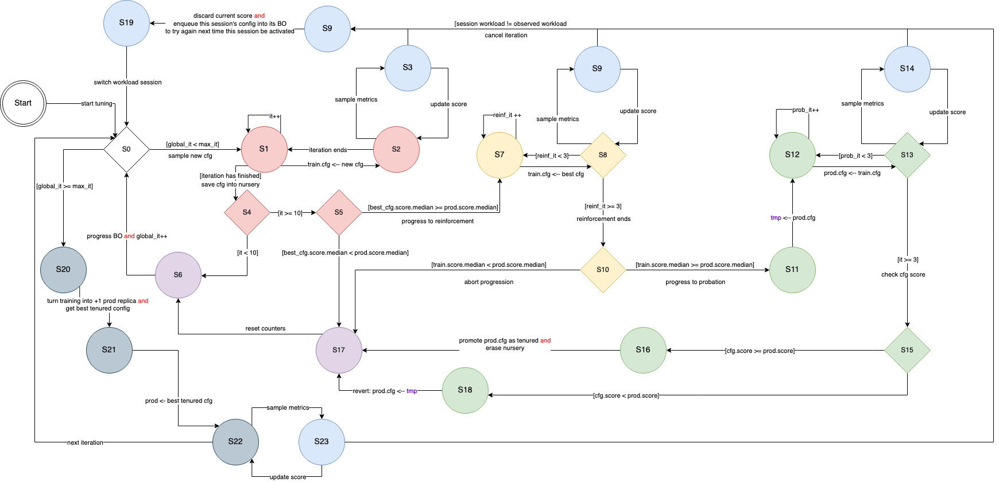

## Build

It may be necessary to update the repository for the images in `Makefile`. It is
recommended do not using Docker Hub due to [rate
limits](https://www.docker.com/increase-rate-limits). Use [quay.io](quay.io/)
instead.

`make build`

## Architecture

## Implementation

This diagram refers to SmartTuning core implemented in [here](./smarttuning2/planner/iteration.py).

The search space implementation is in
[searchspace.py](./controllers/searchspace.py) and
[searchspacemodel.py](./controllers/searchpacemodel.py)

All other code is plumbing and it is deeply recommended to be
rewritten/refactored for maintainability.

## Package diagram
auto generated with [pyreverse](https://pypi.org/project/pyreverse/)

`pyreverse -o png -k .`

[package diagram](./packages.png)

## Class diagram
auto generated with [pyreverse](https://pypi.org/project/pyreverse/)

`pyreverse -o png -k .`

[class diagram](./classes.png)
